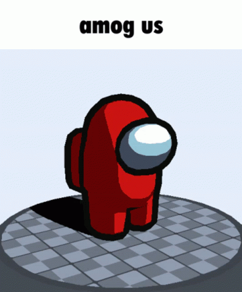
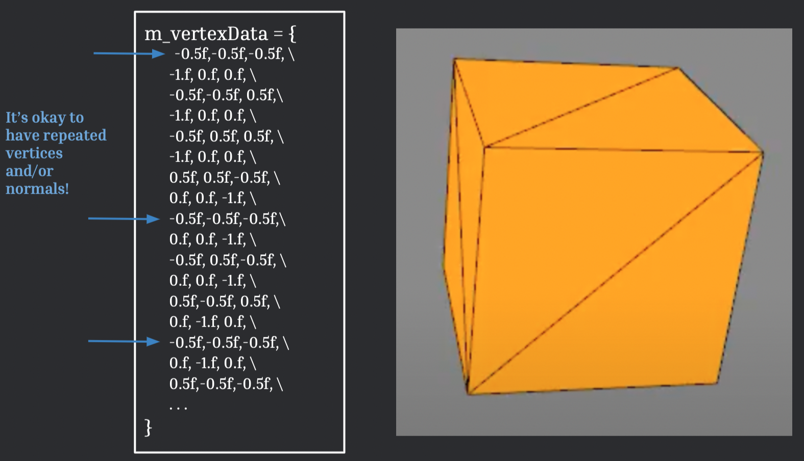
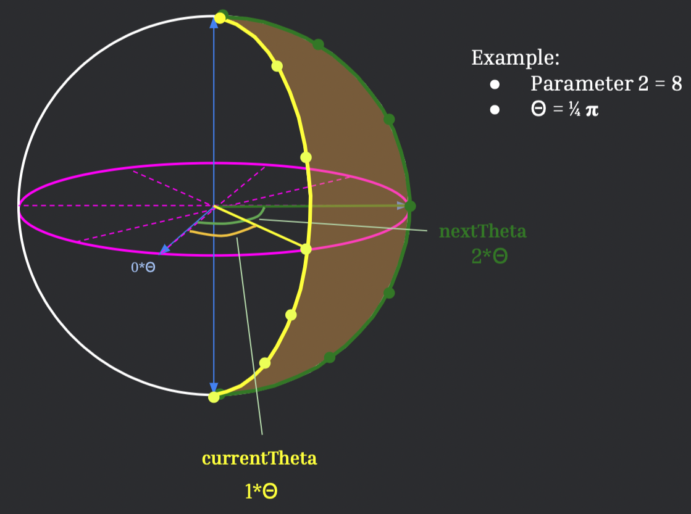

# Lab 8: Trimeshez Lab

[GitHub Classroom assignment](https://google.com)

## 0. Intro

One of the fundamental applications of computer graphics is to display three-dimensional scenes. The catch, however, is that screens can only display two-dimensional images. Therefore, there needs to be some way to convert a three-dimensional scene to something that can be viewed in two dimensions. A common method, which we will use in this lab, is to compose a scene using only triangles, then project those triangles to the screen, drawing each one sequentially.

In this lab, you will be writing the portion of this process that pertains to tesselating objects. You will be breaking up these 3D objects into a lot of triangles that, when put together, look as much like the desired 3D shape as possible. Note that curved surfaces can be better approximated using more triangles, but keep in mind that the more triangles we draw the more triangles we compute, and a major motivation behind tessellating objects is to simplify the process of displaying them.

In the Real-Time projects, you will be displaying scenes made up of the following 3D shapes: Cube, Cone, Cylinder, and Sphere. In this lab, you will be implementing two of the four shapes, Cube and Sphere. You will implement the remaining shapes, Cylinder and Cone, in the first Real-Time Project. Throughout the rest of this handout there will be a couple of suggestions that we highly encourage you to consider in your design.

By the end of this lab, you will:

1. Understand that primitives are created from a long list vertices and normals
2. Learn how to calculate normals given 3 points
3. Learn how to create and implement a Cube and a Sphere

## 1. Background

Here are a few concepts that you should know before you implement your Cube and Sphere. These concepts are outlined below.

### 📌 1.1. OpenGL’s 3D Coordinate System

Understanding the coordinate system in OpenGL will save you a lot of debugging time later on. As shown in [Figure 1](#-11-opengls-3d-coordinate-system) below, the positive X axis points towards the right of the screen, the positive Y axis points towards the top of the screen, and the positive Z axis points out of the screen towards the viewer. 


<p align="center"> <b>Figure 1</b>: OpenGL Coordinate System </p>


### 📌 1.2 Drawing a Triangle

#### 🔎 1.2.1 Positions and Normals ####

<p align="center">
	
	<p align="center"> <b>Figure 2</b>: Drawing a Triangle </p>
</p>

As shown in [Figure 2](#-12-drawing-a-triangle) above, to draw a single triangle in OpenGL, you will need to provide the 3 vertex positions (*x*, *y*, *z*) and 3 unit vector normals (*i*, *j*, *k*) of the triangle. The positions are simply the (*x*,*y*,*z*) coordinates of the vertices in world space, and the normals are unit vectors that are perpendicular to the face of the triangle. In this lab and in the Real-Time projects, these points will be contained in a vector of floats, called `std::vector<float> m_vertexData`.

#### 🔎 1.2.2 Calculating Normals ####

<p align="center">
	
	<p align="center"> <b>Figure 4</b>: Calculating Cross Product </p>
</p>

As you learned in the Ray projects, we need to provide the normals of each vertex in a 3D shape to correctly light the 3D shape. Recall from Lab07 Terrain that normals are perpendicular to the surface. As shown in [Figure 4](#-122-calculating-normals) above, normals can be calculated by taking the cross product of two vectors. These two vectors can be created from three vertices.

> Note: Order of cross product matters! If the lighting of the triangle is off, it’s likely that your normals are wrong.

> Note: `glm::cross` and `glm::normalize` are super helpful for calculating the normals.

#### 🔎 1.2.3 Counter-clockwise Order and Alternating Position and Normals ####

You may have noticed in [Figure 2](#-121-positions-and-normals), `m_vertexData` alternates between vertex positions and normals. *Most importantly, you'll also that the vertices and normals are in counter-clockwise order.* Why does this matter? Because of backface culling!

#### 🔎 1.2.4 Backface Culling ####

<p align="center">
	
	<p align="center"> <b>Figure 5</b>: Backface Culling </p>
</p>
<!------>

As shown in [Figure 5](#-124-backface-culling) above, backface culling determines the visibility of a triangle. In other words, one side of the triangle will be visible to the viewer, and the other side of the triangle will be invisible. You can read more about [backface culling here](https://en.wikipedia.org/wiki/Back-face_culling)!

If your triangle is not visible, it’s likely that your points are in the wrong order. Remember, positions and normals have to go in *counter-clockwise* order!

#### 🔎 1.2.5 Composing Multiple Triangles to Create a 3D Shape Mesh ####

<p align="center">
	
	<p align="center"> <b>Figure 6</b>: Hardcoded Cube </p>
</p>

Recall in [1.2.1 Drawing a Triangle](#-12-drawing-a-triangle) how to draw a triangle. As shown in [Figure 6](#-125-composing-multiple-triangles-to-create-a-3d-shape-mesh) above, if you combine multiple triangles together, you’ll end up with a 3D mesh! Neat, right?

To do this, we provide every vertex and normal in the 3D shape to `m_vertexData`. Every triangle is then consecutively drawn to create the full 3D mesh.

> Notice that `m_vertexData` can contain repeats since the vertex/normal will appear in the same place! 

> Don't forget about alternating vertices and normals and counter-clockwise ordering!

Below are other examples of how we can use triangles to make different 3D meshes. The more triangles there are, the more complex the object can be!
<p align="center">

</p>
<!--- images or gifs of trimeshes --->


### Stencil Code and Interacting with the UI ###
**TODO**: explanation of UI and stencil code. Will do this after we write the code lol

📝 **Task 1**

Now that you know everything you need to know about triangles and trimeshes, it's time to create your own!

You will first draw a triangle. In the Triangle class, fill out the `tessellate_triangle()` function stub. Use the coordinate points 
- `(-0.5, -0.5, 0)`
- `(0.5, -0.5, 0)`
- `(0, 0.5, 0)`

Don’t forget the normals!

Your triangle should look like this:

<p align="center">

</p>
<!------>

## 2. Cube

Now that you know how to create a triagnle, you'll soon be able to start creating your own 3D shapes 🤗😇😎. 

For our purposes, each shape is centered at the origin, and has a radius of 1. In other words, they lie in the range [-0.5, 0.5] on all axes. 

As shown below, you’ll notice that there are sliders on the left side of the screen that control the shape parameters. These parameters control the number of triangles used to tessellate each face of the Cube. 

<p align="center">
	
</p>

📝 **Task 2.1**

To create our Cube, you'll first create a tile comprised of two triangles as shown below. In the Cube class, implement the `makeTile()` function stub. This function generates a plane composed of two triangles. Don’t forget the normals!

<details><summary><b>What are the makeTile() inputs and outputs?</b></summary>
	
<p align="center">
	
	<p align="center">Diagram of makeTile() and its Inputs</p>
</p>

As shown above, `makeTile()` takes in 4 inputs:
- `glm::vec3 topLeft`: the position of the top left vertex
- `glm::vec3 bottomLeft`: the position of the bottom left vertex
- `glm::vec3 bottomRight`: the position of the bottom right vertex
- `glm::vec3 topRight`: the position of the top right vertex
	
`makeTile()` outputs:
- `std::vector<float>`: This vector contains the positions and normals of the tile, which then can be concatenated to `m_vertexData`
	
</details>

Your tile should look like this:

<p align="center">

</p>
<!------>

📝 **Task 2.2**

Now that you have your tile, you can create one face of the Cube! In the Cube class, implement the positive x side of the Cube in the `makeFace()` function stub. The face should tesselate differently depending on parameter 1. Use the `makeTile()` function you wrote in Task 2.1.

<details>
  <summary><b>What are the makeFace() inputs and outputs?</b></summary>
	  
`makeFace()` takes in 4 inputs:
- `glm::vec3 topLeft`: the position of the top left vertex of the face
- `glm::vec3 bottomLeft`: the position of the bottom left vertex of the face
- `glm::vec3 bottomRight`: the position of the bottom right vertex of the face
- `glm::vec3 topRight`: the position of the top right vertex of the face
	
`makeFace()` as no outputs. You will directly add your points to `m_vertexData` in this function.
	
</details>

> Note: Don’t forget that parameter 1 controls the number of triangles in each row and column!

You should end up with something that looks like this:

<p align="center">

</p>
<!------>
	
<details>
  <summary>🤔Hint: How do I use the makeTile() function?</summary>
	
The key here is to know what the four points you need to pass into `makeTile()`. Take a look at how parameter 1 affects the tessellation of the face, and how it changes the intervals of where the vertex positions are located.
	
</details>

📝 **Task 2.3**

Now that you have one side of the Cube, you should be able to implement all 6 sides of your Cube using the `makeFace()` function you implemented. It may be helpful to draw a diagram of the Cube to figure out the positions of all its corners!

Your Cube should now look like this:

<p align="center">

</p>
<!---![task2.2 cube gif][gif path]--->

## 3. Sphere

Yay! Congratulations on making your Cube! 🙌 It’s to time to make a Sphere 🥳🎉 This is a wee bit more complicated, but don’t worry we’ll walk you through it!

<p align="center">
	
	<p align="center"> Sphere Parameter Controls </p>
</p>
	
As shown above, the shape parameters for Sphere are slightly different than Cube. The first parameter controls the number of ‘layers’ in the vertical direction (like latitude), and the second parameter controls the number of ‘layers’ in the horizontal direction (like longitude).

When you implement Sphere, you will think of the parameters in term of spherical coordinates: parameter 1 controls 𝜙 and parameter 2 controls 𝜃.
	  
> Note: Like Cube, the Sphere is centered at (0, 0, 0) and has a radius of 0.5

<details>
  <summary><b>What is the Spherical Coordinate System?</b></summary>
	
Remember polar coordinates (*r*, 𝜃) from high school geometry? Spherical coordinates (*r*, 𝜃, 𝜙) are like polar coordinates, but in 3D! The spherical coordinate system specifies a 3D point in space using (*r*, 𝜃, 𝜙). For more details, read this [Wikipedia article on the Spherical Coordinate System](https://en.wikipedia.org/wiki/Spherical_coordinate_system).
	
> Note: Pay attention to the direction of the axes and thus what 𝜃 and 𝜙 represent! Our diagram is different from the diagram in the wikipedia article above because we are using the OpenGL coordinate system (as described in [1.1 OpenGL Coordinate System](#-11-opengls-3d-coordinate-system))!

| Coordinate | Diagram |
| :---------------------------------------------------------------: | :---------------------------------------------------------------: |	
| *r*: the radial distance from the origin. For sphere, `r=0.5` |  |	
| 𝜃: the polar angle. For sphere, this is in radians. |  |
| 𝜙: the azimuthal angle. For sphere, this is in radians. |  |

</details>

### 📌 3.1 Oranges! 🦧🍊🍊🍊

<p align="center">
	
</p>

As shown above, you can think of a sphere like an orange. Oranges are made up of slices and each slice is made up of segments. We can build an orange (aka a sphere) by procedurally generating a collection of orange slices (aka a sphere slice). In the following task, you will implement this orange slice.

<details>
  <summary>Orange Slices and Segments in Terms of Parameters 1 and 2</summary>
	
- Orange Slice: The number of slices in the orange are controlled by parameter 2 (which is used to calculate 𝜃). 
- Orange Segment: The number of segments are controlled by parameter 1 (which is used to calculate 𝜙). 
	
Using both these parameters and knowing that the radius is 0.5, we can determine the exact 3D location of each vertex with spherical coordinates!
	
</details>

📝 **Task 3.1.1**

Copy your `makeTile()` function from your Cube class into the Sphere class. You will use this function when implementing Sphere.

📝 **Task 3.1.2**

In the Sphere class, implement a slice of the Sphere in the `make_slice()` function stub. Use your `makeTile()` function that you copied over. This is the most difficult task, so we have provided a few hints below if you get stuck. Try thinking about how you may calculate 𝜙 and how you may use that to generate a slice. Try implementing your ideas, and if you get stuck, you may reveal a hint or ask one of the TA’s for help!

> Note: You may find the following useful in your implementation: `glm::radians()`, `glm::sin()`, and `glm::cos()`

> Note: Everything is in radians!

<details>
	<summary><b>What are the make_slice() inputs and outputs?</b></summary>

<p align="center">
	
	<p align="center">Diagram of currentTheta and nextTheta</p>
</p>
	
`make_slice()` inputs:
- `currentTheta`: the 𝜃 of all the vertices on the left side of the slice
- `nextTheta`: the 𝜃 of all the vertices on the right side of the slice.
	
`make_slice()` has no outputs. You will directly add your points to `m_vertexData` in this function.

</details>

Your slice should look like this:
<p align="center">
	
</p>
<!------>

<details>
  <summary>🤔Hint: How do I calculate 𝜙?</summary>
	
<p align="center">
	
	<p align="center">Diagram of 𝜙</p>
</p>
	𝜙 = 𝜋 / param1
	
Refer to the diagram above to understand the reasoning behind this calculation. 
	
</details>

<details>
  <summary>🤔Hint: How do I use 𝜃 and 𝜙 to calculate my four points for makeTile()?</summary>
	
> Note: Notice the start and end angles of 𝜙!

You can get the 3D position using the following equations:

	x = r * sin(𝜃) * cos(𝜙)

	y = r * sin(𝜃) * sin(𝜙)

	z = r * cos(𝜃)
	
</details>

<details>
  <summary>🤔Hint: Help! But the top and bottom of the slice are triangles???</summary>
	
Don’t worry, that’s okay! You can still use your `makeTile()` function to make these triangles. Remember that `makeTile()` generates a plane consisting of two triangles. But what if the two triangles were overlapping 🤔🤔🤔. Then the tile would look like a triangle, right?
	
In order to make code cleaner and more concise, it’s a good idea to reuse functions where you can. Sometimes, in Computer Graphics that means you will have overlapping triangles, but that’s okay because they are going to appear in the same place anyway 😁.
	
Think about what input vertex positions to `makeTile()` would yield a triangle, and use that to make the top and bottom of your slice!
	
(If you really don’t want to use `makeTile()` for the top and bottom triangles, you may implement them separately from your `makeTile()` calls.)
	
</details>

<details>
	<summary>🤔Hint: Pseudocode</summary>

```cpp
For each segment {
	// calculate currentPhi
	// calculate nextPhi

	// using currentTheta and currentPhi, calculate the bottomLeft point 
	// using nextTheta and currentPhi, calculate the bottomRight point 
	// using currentTheta and nextPhi, calculate the topLeft
	// using nextTheta and nextPhi, calculate the topRight point 

	makeTile(topLeft, bottomLeft, bottomRight, topRight)
	// add output of makeFace to m_vertexData
}
```
	
</details>

📝 **Task 3.2**

Once you have finished making a singular slice of the orange, it’s time to make the whole orange! Implement the `make_orange()` function stub in the Sphere class.

<details>
	<summary><b>What are the make_orange() inputs and outputs?</b></summary>
	
- `make_orange()` has no inputs.
- `make_orange()` has no outputs. You will directly add your points to `m_vertexData` in this function.
	
</details>

Your sphere should look like this:

<p align="center">

</p>
<!------>

<details>
	<summary>🤔Hint: Pseudocode</summary>
	
```cpp
For each orange_slice {
	// calculate the currentTheta
	// calculate the nextTheta
	make_slice();

	// add vertices and normals to m_vertexData
}
```
	
</details>

## End

Now you’re ready to show your work to a TA and get checked off! Congrats on finishing the Trimeshez lab 🥳🎉

🥟 **Food for Thought** 🍾🥂

Next week, you will be learning how to use OpenGL to render triangle meshes. OpenGL uses VBOs (vertex buffer objects) which store a list of vertices similar to `m_vertexData` in this lab. You’ll learn more about this next week, but we just wanted to give you a brief intro. Good luck!
